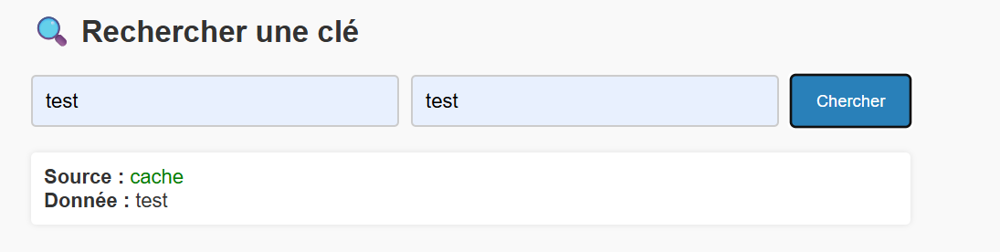
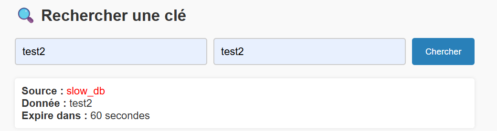
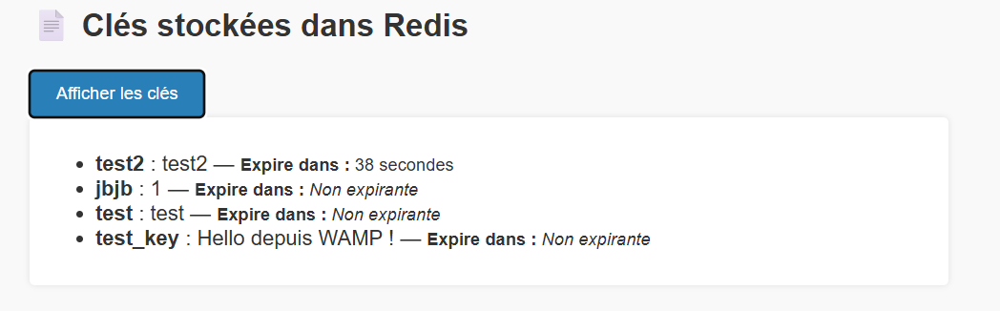
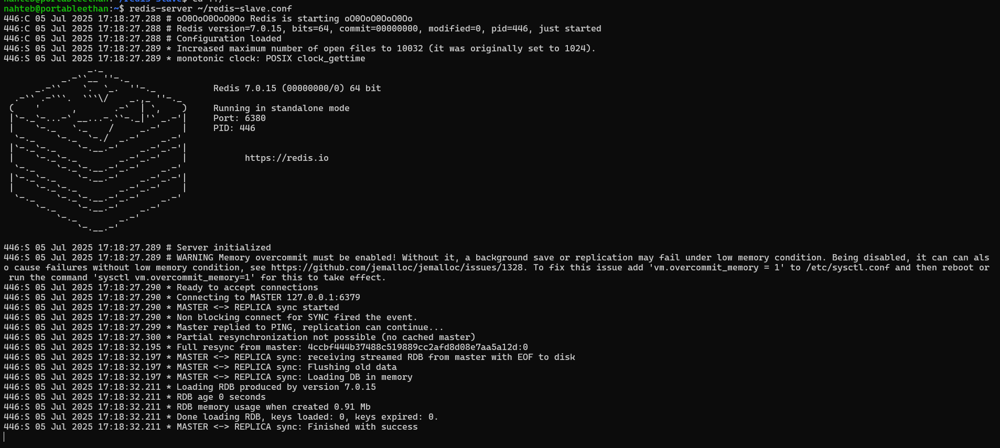
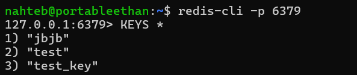
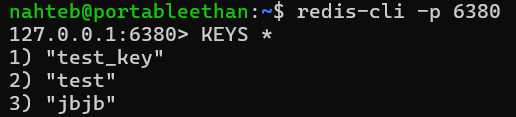
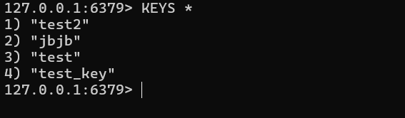
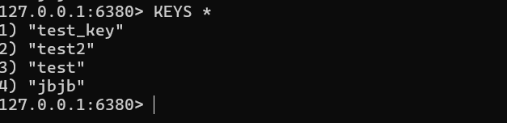

# Déploiement et utilisation de Redis

## Objectif

Ce projet démontre l'utilisation de **Redis** en tant que **cache distribué** dans une application PHP.  
Nous validons ici :

- L’amélioration des performances par le cache Redis
- L’expiration automatique des données
- La distribution des données via **réplication** ou **sharding**

---

## Fonctionnalités principales

1. **Requête d’une clé** :  
   - Si la donnée est présente dans le cache Redis ➜ elle est retournée immédiatement 
   - Sinon, on réalise une simulation d’une requête lente, puis onme en cache la donnée avec une date d'expiration

2. **Affichage de toutes les clés Redis** actuellement stockées

3. **Affichage du temps restant avant expiration** pour les données simulées

---

## Démonstration 

### 1. Gain de performance grâce à Redis

- Une première requête d’une nouvelle clé prend ~2 secondes (simule une source lente).
- La **seconde requête est instantanée** (grâce au cache Redis).

On peut voir sur l’image ci-dessous que, lorsqu’on recherche une donnée déjà présente dans le cache, celle-ci est renvoyée immédiatement:



Maintenant si on cherche une donnés qui n'est pas présente dans le cache redis, on obtiens ceci:



On peut voir que comme cet donné n'est pas présent dans le cache redis, elle a été ajouté et donné un temps d'expiration (ici 60 secondes)

### 2. Donnée temporaire / expiration automatique

- Les données mises en cache sont stockées avec un TTL de **60 secondes**.
- L’utilisateur peut voir combien de secondes il reste avant expiration via la recherche ou directement via l'affichage des clés stockés prévu à cet effet.




### 3. Distribution : Réplication (Master/Slave)

#### 🛠 Mise en place simple

Pour cette démonstration, deux instances Redis sont utilisées :

* Une instance **master** sur le port `6379`
* Une instance **slave** (ou réplica) sur le port `6380`

La réplication est configurée dans le fichier `redis-slave.conf` avec la ligne suivante :

```bash
replicaof 127.0.0.1 6379
```

Cela indique que le serveur Redis sur le port `6380` doit répliquer les données depuis le serveur master sur le port `6379`.

#### ▶️ Lancer les instances

Ouvrir deux terminaux :

**Terminal 1** (master) :

```bash
redis-server redis.conf
```

**Terminal 2** (slave) :

```bash
redis-server redis-slave.conf
```
Ce qui nous donne l’image suivante, confirmant que le serveur Redis a bien démarré :

#### 🔌 Se connecter aux deux serveurs

* Pour le master :

```bash
redis-cli -p 6379
```
Une fois connecté, vous pouvez afficher toutes les clés présentes avec la commande :


* Pour le slave :

```bash
redis-cli -p 6380
```
De la même manière, vous pouvez vérifier que la réplication fonctionne bien en listant les mêmes clés :


Une fois connecté, on peut maitenant tester la réplication sur l'application directement en ajouté une clé test2 ici :


Maintenant que cela est fait, regardons dans le master voir ce qui s'est passé en relistant les clés:
 
On peut voir que cet clé a bien été ajouté dans le master.

Regardons maintenant dans le slave, voir ce qui se passe:
 
On peut voir que le système de réplication fonctionne car cet clé est aussi sur le slave.
